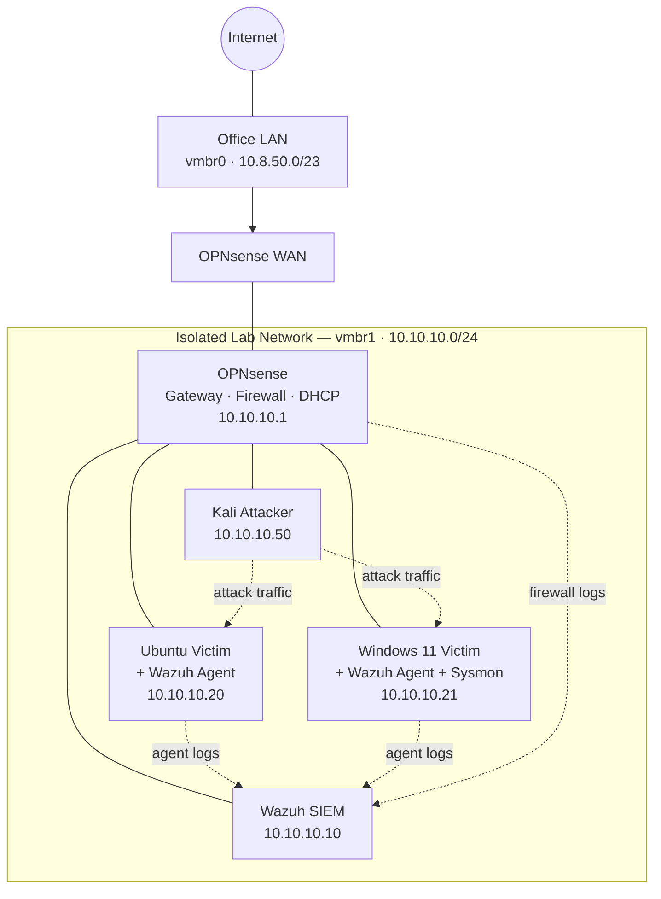

# 🛡️ Homelab SIEM Lab

> **End-to-end attack simulation and detection on a self-hosted Proxmox homelab — built on an Intel N305 mini PC, powered by Wazuh, and documented from bare metal to blocked attack.**

---

## Overview

This project documents the complete build of an isolated cybersecurity homelab — from flashing a Proxmox ISO to simulating real ATT&CK-mapped attacks and automatically blocking them with a SIEM.

Every phase is reproducible. Every attack is mapped to MITRE ATT&CK. Every detection rule is included.

**Hardware:** SZBOX H14 mini PC (Intel i3-N305, 16GB RAM)  
**Host:** Proxmox VE 8.x  
**SIEM:** Wazuh (single-node)  
**Attacker:** Kali Linux  
**Victims:** Ubuntu Server 24.04, Windows 11  
**Firewall/Gateway:** OPNsense  
**Remote Access:** Tailscale

---

## Architecture



---

## Phases

| # | Phase | Doc | Status |
|---|-------|-----|--------|
| 1 | Proxmox install — bare metal to web UI | [01-proxmox-install.md](docs/01-proxmox-install.md) | completed |
| 2 | Proxmox hardening + Tailscale remote access | [02-proxmox-hardening.md](docs/02-proxmox-hardening.md) | completed |
| 3 | Lab networking — isolated bridge + OPNsense | [03-lab-networking.md](docs/03-lab-networking.md) | completed |
| 4 | Wazuh SIEM deployment | [04-wazuh-setup.md](docs/04-wazuh-setup.md) | completed |
| 5 | Victim setup + agent telemetry | [05-victim-telemetry.md](docs/05-victim-telemetry.md) | completed |
| 6 | Attack simulation (ATT&CK-mapped) | [06-attack-simulation.md](docs/06-attack-simulation.md) | ⏳ Pending |
| 7 | Detection — Wazuh rules + dashboard | [07-detection.md](docs/07-detection.md) | ⏳ Pending |
| 8 | Defense — active response + re-test | [08-defense.md](docs/08-defense.md) | ⏳ Pending |

---

## ATT&CK Coverage

| Technique ID | Name | Tool Used | Wazuh Rule | Status |
|---|---|---|---|---|
| T1110.001 | Brute Force: Password Guessing | Hydra | Custom rule `100001` | ⏳ Pending |
| T1046 | Network Service Discovery | Nmap | Built-in | ⏳ Pending |
| T1059.004 | Command & Scripting: Bash | Manual | auditd | ⏳ Pending |
| T1003 | OS Credential Dumping | Mimikatz / Atomic | Sysmon + custom rule | ⏳ Pending |
| T1059.001 | PowerShell execution | Atomic Red Team | Sysmon Event ID 4104 | ⏳ Pending |

*Table updated as each phase is completed.*

---

## Repo Structure

```
.
├── README.md
├── docs/
│   ├── diagrams/          # architecture and network diagrams
│   ├── screenshots/       # evidence screenshots per phase
│   ├── 01-proxmox-install.md
│   ├── 02-proxmox-hardening.md
│   ├── 03-lab-networking.md
│   ├── 04-wazuh-setup.md
│   ├── 05-victim-telemetry.md
│   ├── 06-attack-simulation.md
│   ├── 07-detection.md
│   └── 08-defense.md
├── detections/            # custom Wazuh rules and Sysmon config
└── attacks/               # attack scripts and Atomic Red Team notes
```

---

## Why I Built This

I work in an IT/security role and wanted to go beyond theory — actually building the infrastructure, simulating the attacks, writing the detection rules, and proving the defenses work. This homelab runs on a mini PC at my office and is fully remote-accessible via Tailscale.

Every phase of this project reflects something I learned by doing it wrong first.

---

## References

- [Proxmox VE Documentation](https://pve.proxmox.com/pve-docs/)
- [Wazuh Documentation](https://documentation.wazuh.com)
- [OPNsense Documentation](https://docs.opnsense.org)
- [MITRE ATT&CK Framework](https://attack.mitre.org)
- [Atomic Red Team](https://github.com/redcanaryco/atomic-red-team)

---

*Built and documented by [SamuelKhawsigan](https://github.com/SamuelKhawsigan)*
