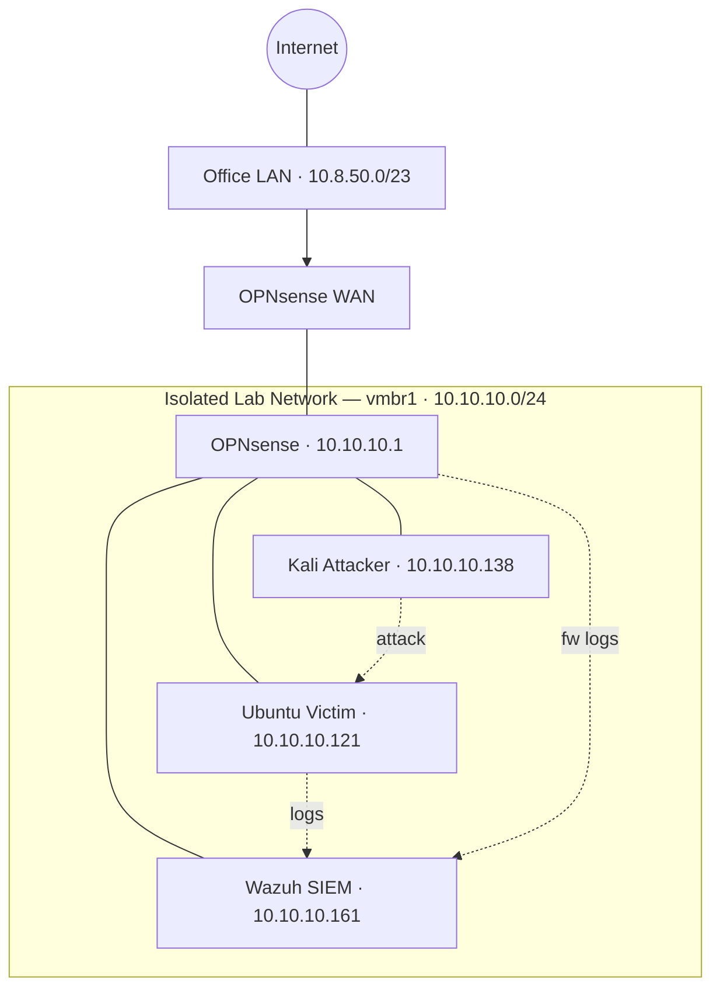

# Lab Network Architecture

```mermaid
flowchart TB
    NET((Internet))
    HOME[Office LAN · 10.8.50.0/23]
    NET --- HOME
    HOME --> WAN[OPNsense WAN]
    subgraph LAB["Isolated Lab Network — vmbr1 · 10.10.10.0/24"]
        FW[OPNsense · 10.10.10.1]
        WZ[Wazuh SIEM · 10.10.10.161]
        VIC1[Ubuntu Victim · 10.10.10.121]
        ATK[Kali Attacker · 10.10.10.138]
    end
    WAN --- FW
    FW --- WZ
    FW --- VIC1
    FW --- ATK
    ATK -.->|attack| VIC1
    VIC1 -.->|logs| WZ
    FW -.->|fw logs| WZ
```
